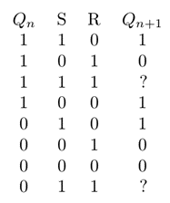

Programmation Java @ Et3
<br>
Polytech Paris-Saclay | 2019-20

___

# TP4

Les portes logiques sont des circuits électroniques qui possèdent des entrées et des sorties sur lesquelles on place et récupère des valeurs de bits. Les portes logiques ET-NON (nand) possèdent deux entrées A et B. La sortie Q est au niveau 0 (ou false) si toutes les entrées sont au niveau 1 (ou true). Une seule entrée au niveau 0 suffit pour que la sortie soit à 1. Les symboles de ce type de portes est représenté ci-dessous :

<br><div align="center"></img></div><br>

Les portes logiques OU-NON (nor), qui possèdent également deux entrées A et B, ont leur sortie au niveau 1 si toutes les entrées sont au niveau 0. Une seule entrée au niveau 1 suffit pour que la sortie soit à 0. Ce type de porte a pour symbole :

<br><div align="center"></img></div><br>

Les circuits séquentiels sont obtenus par combinaison de portes logiques, avec certaines sorties qui sont rebouclées en entrée. Contrairement aux portes logiques, l’état des sorties des circuits séquentiels dépend non seulement de l’état des entrées mais aussi de l’état antérieur des sorties : ce sont des circuits dotés de mémoire.

Les bascules RS sont des bistables qui peuvent prendre deux états. Ces bascules sont asynchrones. Elles possèdent deux entrées nommées R et S et deux sorties complémentaires nommées Q et Q̄. L’entrée S (set) met la bascule au travail et la sortie Q à la valeur 1. L’entrée R (reset) remet la bascule au repos et la sortie Q à la valeur 0. La représentation d'une bascule RS avec des portes nor est donnée ci-dessous :

<br><div align="center"></img></div><br>

On envoie séparément et alternativement les signaux sur S et R. Dans le cas particulier où S = R = 1, l’état de la sortie est indéterminé. La table de vérité en fonction de l’état précédent Qn est la suivante :

<br><div align="center"></img></div><br>

4#1. On souhaite modéliser des portes nand et nor par des classes en factorisant au mieux le code : on aura donc recours à une classe abstraite pour représenter des portes logiques, puis à des classes concrètes dérivant de cette classe abstraite pour représenter chaque type de porte. Toute modification d'une des entrées doit entraîner la mise à jour de la sortie de la porte. Écrivez les classes nécessaires en les dotant de méthodes utiles pour l’affichage de l’état de leurs objets ainsi que des méthodes d'altération (setters) et de consultation (getters) utiles.

> On crée tout d'abord la classe abstraite `PorteLogique` en factorisant au maximum notre code. Pour cela, il faut réfléchir aux points communs entre les deux portes logiques présentées ici : NAND et NOR. Dans les deux cas, on retrouve deux entrées et une sortie. Les setters, getters et les méthodes d'aaffichage seront donc identiques pour toutes les portes logiques. La seule différence se fait sur le calcul de la sortie. Il faudra donc déclarer la méthode liée à ce calcul comme étant `abstract` car elle devra forcémment être redéfinie dans les classes filles de `PorteLogique`.
>
> ```Java
> package et3.java.portes;
> 
> public abstract class PorteLogique
> {
> 	protected boolean entree1;
> 	protected boolean entree2;
> 	protected boolean sortie;
> 	
> 	/**
> 	 * Constructeur de la classe {@link PorteLogique}
> 	 */
> 	public PorteLogique()
> 	{
> 		this.entree1 = false;
> 		this.entree2 = false;
> 		this.calculerSortie();
> 		this.nombreCycles = 0;
> 		this.nombreCyclesMaximum = 10;
> 	}
> 	
> 	/**
> 	 * Constructeur de la classe {@link PorteLogique}
> 	 * @param entree1 La première entrée de la porte logique
> 	 * @param entree2 La deuxièeme entrée de la porte logique
> 	 */
> 	public PorteLogique(boolean entree1, boolean entree2)
> 	{
> 		this.entree1 = entree1;
> 		this.entree2 = entree2;
> 		this.calculerSortie();
> 	}
> 	
> 	/**
> 	 * Cette méthode permet d'accèder aux valeurs des entrées de la porte logique
> 	 * @return Le tableau contenant les valeurs des entrées de la porte logique
> 	 */
> 	public boolean[] getEntrees()
> 	{
> 		boolean[] entrees = {entree1, entree2};
> 		return entrees;
> 	}
> 	
> 	/**
> 	 * Cette méthode permet de modifier les valeurs des entrées de la porte logique
> 	 * @param entree1 La valeur de la première entrée de la porte logique
> 	 * @param entree2 La valeur de la deuxièeme entrée de la porte logique
> 	 */
> 	public void setEntrees(boolean entree1, boolean entree2)
> 	{
> 		this.entree1 = entree1;
> 		this.entree2 = entree2;
> 		this.calculerSortie();
> 	}
> 	
> 	/**
> 	 * Cette méthode permet de modifier les valeurs des entrées de la porte logique
> 	 * @param entrees Le tableau contenant les valeurs des entrées de la porte logique
> 	 */
> 	public void setEntrees(boolean[] entrees)
> 	{
> 		this.entree1 = entrees[0];
> 		this.entree2 = entrees[1];
> 		this.calculerSortie();
> 	}
> 	
> 	/**
> 	 * Cette méthode permet d'accèder à la valeur de la sortie de la porte logique
> 	 * @return La valeur de la sortie de la porte logique
> 	 */
> 	public boolean getSortie()
> 	{
> 		return sortie;
> 	}
> 	
> 	/**
> 	 * Cette méthode permet de calculer et mettre à jour la sortie de la porte logique
> 	 */
> 	protected abstract void calculerSortie();
> 	
> 	@Override
> 	public String toString()
> 	{
> 		return "entrée1 = " + entree1 + " | entrée2 = " + entree2 + " | sortie = " + sortie;
> 	}
> }
> ```
> 
> On peut ensuite définir les classes filles de `PorteLogique` en définissant leurs constructeurs et en implémentant `calculerSortie()` qui a précedemment été définie `abstract`.
> 
> ```Java
> package et3.java.portes;
> 
> import et3.java.exceptions.ExceptionPorteAChanger;
> 
> public class Nand extends PorteLogique
> {	
> 	/**
> 	 * Constructeur de la classe {@link Nand}
> 	 */
> 	public Nand()
> 	{
> 		super();
> 	}
> 	
> 	/**
> 	 * Constructeur de la classe {@link Nand}
> 	 * @param entree1 La première entrée de la porte logique Nand
> 	 * @param entree2 La deuxièeme entrée de la porte logique Nand
> 	 */
> 	public Nand(boolean entree1, boolean entree2)
> 	{
> 		super(entree1, entree2);
> 	}
> 	
> 	@Override
> 	protected void calculerSortie() 
> 	{
> 		if(entree1 && entree2)
> 		{
> 			sortie = false;
> 		}
> 		else
> 		{
> 			sortie = true;
> 		}
> 	}
> }
> ```
> ```Java
> package et3.java.portes;
> 
> import et3.java.exceptions.ExceptionPorteAChanger;
> 
> public class Nor extends PorteLogique
> {
> 	/**
> 	 * Constructeur de la classe {@link Nor}
> 	 */
> 	public Nor()
> 	{
> 		super();
> 	}
> 	
> 	/**
> 	 * Constructeur de la classe {@link Nor}
> 	 * @param entree1 La première entrée de la porte logique Nor
> 	 * @param entree2 La deuxièeme entrée de la porte logique Nor
> 	 */
> 	public Nor(boolean entree1, boolean entree2)
> 	{
> 		super(entree1, entree2);
> 	}
> 
> 	@Override
> 	protected void calculerSortie() 
> 	{
> 		if(entree1 || entree2)
> 		{
> 			sortie = false;
> 		}
> 		else
> 		{
> 			sortie = true;
> 		}
> 	}
> }
> ```

4#2. Réalisez des tests au niveau de la classe permettant d'obtenir la table de vérité de chacune des portes. Pour cela, passez par des variables du type de votre classe représentant une porte logique (les méthodes invoquées ne dépendant pas du type concret particulier).

> ```Java
> ```

4#3. Écrivez à présent une classe modélisant une bascule RS composée de 2 portes nor, et implémentant les méthodes :
— getS, getR, getQ, getNonQ pour obtenir l’état des valeurs correspondantes ;
— les méthodes setS et setR pour changer l’entrée de la bascule et calculer un nouvel état ;
— une méthode pour afficher l’état de la bascule.

> ```Java
> ```

4#4. On souhaite à présent ajouter aux portes logiques un nombre de cycles maximum au bout duquel la porte est à changer. On comptera comme cycle toute opération de lecture ou d’écriture sur la porte logique. Ajoutez le code nécessaire pour prendre en compte ce nombre de cycles maximum (qui pourra être défini au niveau de chaque porte particulière), puis mettez en œuvre la notion d’exception pour prendre en compte des erreurs au niveau des portes logiques ainsi qu'au niveau des bascules RS. Vous devrez avoir les trois types d'exceptions suivants : ExceptionPorteLogique, ExceptionPorteAChanger (sous-type de ExceptionPorteLogique), et ExceptionBasculeAReparer (qui devra renseigner quelle porte de la bascule doit être changée).

> ```Java
> ```

4#5. (optionnel) Implémentez une stratégie de récupération du type d’erreur correspondant à l'exception ExceptionBasculeAReparer au niveau de la classe représentant la bascule RS (remplacement d’une porte logique défaillante).

> ```Java
> ```
